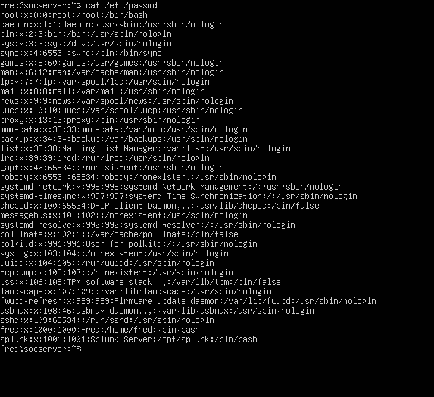
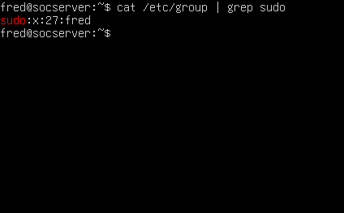
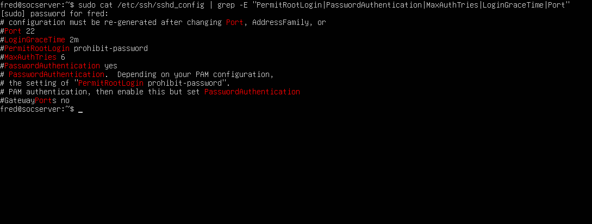
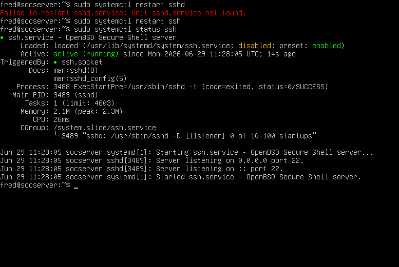
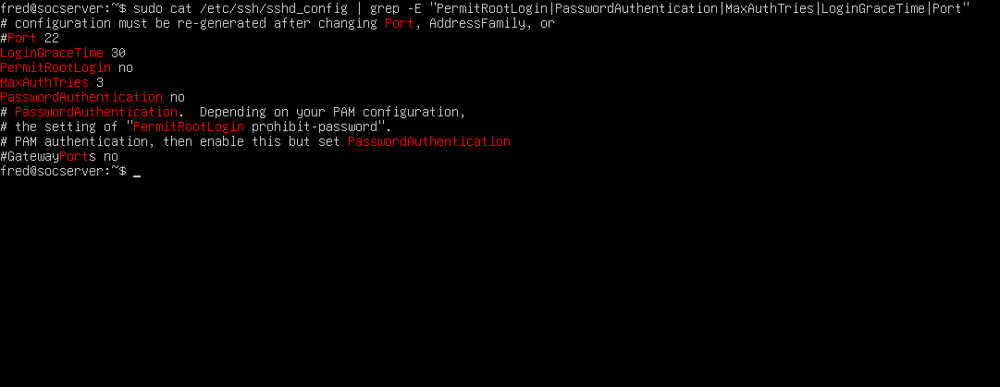
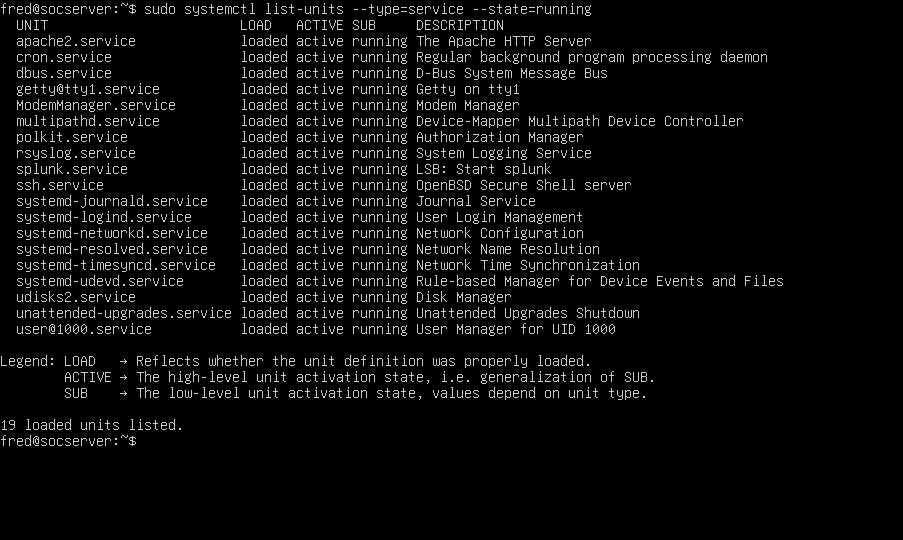
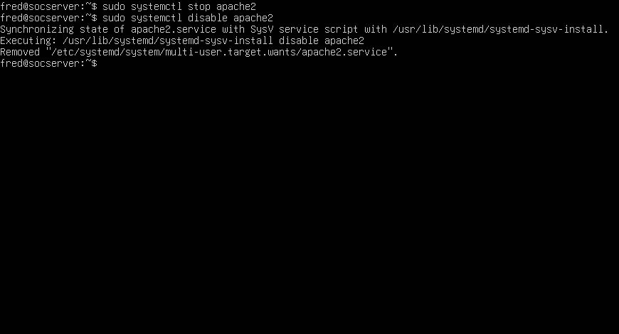
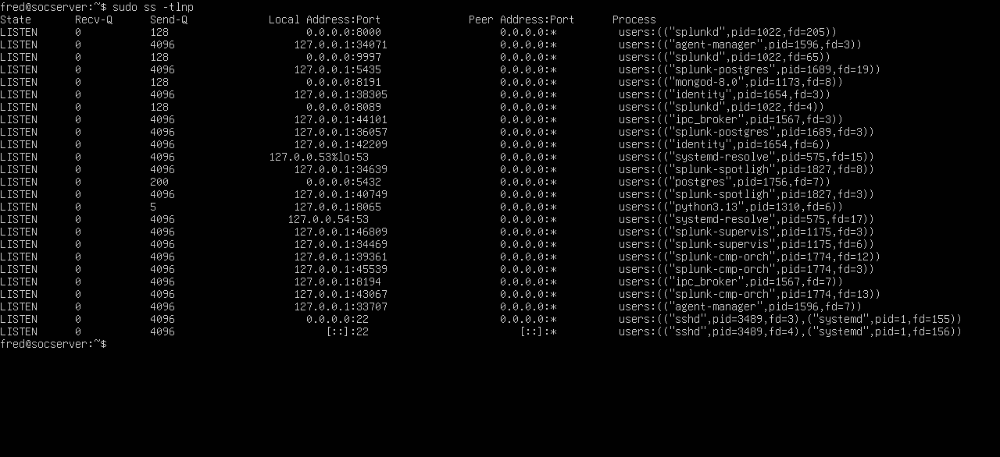
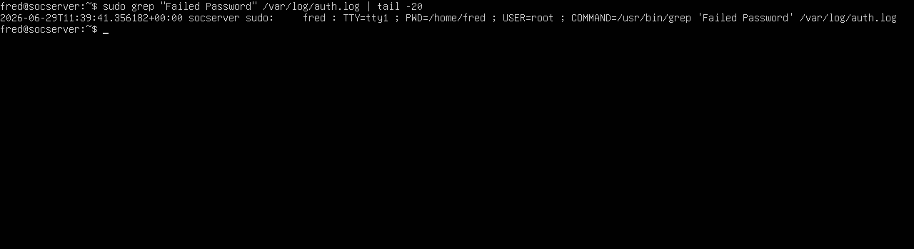
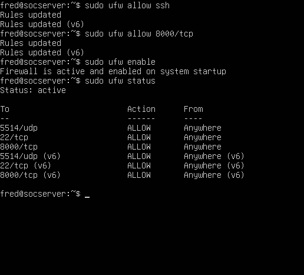

# 🔒 Ubuntu Server Hardening
### Auditing and Securing a Linux Server Against Real World Attacks

---

## 🎯 What This Project Is About

This project performs a complete security audit and
hardening of an Ubuntu Server in a real homelab
environment. We identify security weaknesses,
fix misconfigurations, disable unnecessary services
and configure a host-based firewall.

This is exactly what security engineers and SOC
analysts do when securing or investigating Linux
servers in enterprise environments.

Server role: Splunk SIEM host and SOC server
OS: Ubuntu Server 24.04.4 LTS
Hostname: socserver

---

## 🧠 Understanding Server Hardening

### What is Server Hardening?

Hardening means reducing the attack surface of a
server by:
- Removing unnecessary services and software
- Fixing insecure default configurations
- Enforcing least privilege on users and files
- Enabling logging and monitoring
- Configuring host-based firewall rules

Every unnecessary service running is a potential
entry point for attackers. Every misconfigured
setting is a potential vulnerability.

### The Hardening Mindset

Before hardening ask three questions:
1. Does this service need to be running?
2. Is this configuration as secure as it can be?
3. Is everything being logged?

---

## 🎯 MITRE ATT&CK Mapping

| Technique | ID | What hardening prevents |
|---|---|---|
| Brute Force SSH | T1110.001 | MaxAuthTries and PasswordAuthentication no |
| Valid Accounts | T1078 | User audit catches backdoor accounts |
| Create Account | T1136 | Monitoring /etc/passwd for new users |
| SSH Authorized Keys | T1098.004 | Auditing authorized_keys file |
| Disable Security Tools | T1562 | UFW prevents service tampering |
| Exploit Public Service | T1190 | Disabling unnecessary services |

### Defensive Technique Applied
Network Segmentation and Host Hardening — M1030
Limit access to resources over the network based
on need. Remove or disable unnecessary services.

---

## 🛠️ Prerequisites

### Environment
| Component | Details |
|---|---|
| OS | Ubuntu Server 24.04.4 LTS |
| Hostname | socserver |
| IP Address | 192.168.20.101 |
| User | fred (sudo privileges) |
| Role | Splunk SIEM host |

### Required Access
- Direct console or SSH access to Ubuntu Server
- sudo privileges on the server
- Basic Linux command line knowledge

---

### Hardening Areas Covered

```
Ubuntu Server 192.168.20.101
│
├── User Security
│   ├── /etc/passwd — audit all accounts
│   ├── /etc/shadow — password storage
│   └── /etc/group  — sudo group members
│
├── SSH Hardening
│   └── /etc/ssh/sshd_config
│       ├── PermitRootLogin no
│       ├── PasswordAuthentication no
│       ├── MaxAuthTries 3
│       └── LoginGraceTime 30
│
├── Service Auditing
│   ├── List all running services
│   └── Disable unnecessary — apache2
│
├── Port Auditing
│   └── ss -tlnp — verify open ports
│
├── Log Analysis
│   ├── /var/log/auth.log
│   └── Check failed and accepted logins
│
└── UFW Firewall
    ├── Allow SSH (22/tcp)
    ├── Allow Splunk (8000/tcp)
    ├── Allow Syslog (5514/udp)
    └── Block everything else
```

---

## 🔬 Step by Step — How to Replicate

### Step 1 — User Account Audit

View all user accounts on the system:
```
cat /etc/passwd
```

What to look for:
- Only one user with UID 0 — that must be root only
- No unexpected accounts with /bin/bash shell
- System accounts should have /sbin/nologin or /bin/false

Check sudo group members:
```
cat /etc/group | grep sudo
```

Expected result — only your admin user:
```
sudo:x:27:fred
```

Red flags:
- Any unknown user with UID 0
- Unknown users in sudo group
- New accounts you did not create

Results on this server:
- Only root has UID 0 ✅
- Only fred is in sudo group ✅
- No suspicious accounts found ✅

---

### Step 2 — Audit SSH Configuration (Before Hardening)

View current SSH settings:
```
sudo cat /etc/ssh/sshd_config | grep -E "PermitRootLogin|PasswordAuthentication|MaxAuthTries|LoginGraceTime|Port"
```

Issues found on this server before hardening:
```
PasswordAuthentication yes  ← INSECURE
MaxAuthTries 6              ← Too high
LoginGraceTime 2m           ← Too long
PermitRootLogin prohibit-password ← Partial only
```

---

### Step 3 — Harden SSH Configuration

Open SSH config file:
```
sudo nano /etc/ssh/sshd_config
```

Find and update these four settings
(remove the # comment and change the value):
```
PermitRootLogin no
PasswordAuthentication no
MaxAuthTries 3
LoginGraceTime 30
```

Save with Ctrl+X then Y then Enter.

Restart SSH to apply changes:
```
sudo systemctl restart ssh
```

Verify SSH is running:
```
sudo systemctl status ssh
```

Expected result:
```
ssh.service — Active: active (running) ✅
Server listening on 0.0.0.0 port 22
```

Verify changes took effect:
```
sudo grep -E "PermitRootLogin|PasswordAuthentication|MaxAuthTries|LoginGraceTime" /etc/ssh/sshd_config | grep -v "^#"
```

Expected result after hardening:
```
LoginGraceTime 30
PermitRootLogin no
MaxAuthTries 3
PasswordAuthentication no
```

Why each setting matters:
- PermitRootLogin no — attacker cannot SSH directly as root
- PasswordAuthentication no — eliminates brute force entirely
- MaxAuthTries 3 — automated tools disconnected after 3 attempts
- LoginGraceTime 30 — reduces connection timeout window

---

### Step 4 — Audit Running Services

List all running services:
```
sudo systemctl list-units --type=service --state=running
```

Findings on this server:

Expected services (keep running):
```
ssh.service      — SSH server — needed
splunk.service   — Splunk SIEM — needed
rsyslog.service  — System logging — needed
cron.service     — Scheduled tasks — needed
```

Unnecessary service found:
```
apache2.service  — Web server — NOT needed on SOC server
```

Apache2 is a web server. This machine is a SOC
server running Splunk — not a web server. Running
apache2 unnecessarily exposes port 80 and increases
attack surface.

Disable apache2:
```
sudo systemctl stop apache2
sudo systemctl disable apache2
```

Expected result:
```
Removed /etc/systemd/system/multi-user.target.wants/apache2.service
```

To start apache2 again when needed:
```
sudo systemctl start apache2
```

---

### Step 5 — Audit Open Ports

Check all listening ports:
```
sudo ss -tlnp
```

Findings on this server:
```
Port 8000  — splunkd — Splunk web interface ✅
Port 22    — sshd    — SSH server ✅
Port 5432  — Splunk PostgreSQL — internal only ✅
```

After disabling apache2 — port 80 completely
absent from the list confirming successful
service removal.

Most ports listening on 127.0.0.1 — local only
meaning they cannot be accessed from the network.

---

### Step 6 — Analyze Authentication Logs

Check for failed login attempts:
```
sudo grep "Failed password" /var/log/auth.log | tail -20
```

Check for successful logins:
```
sudo grep "Accepted" /var/log/auth.log
```

Findings on this server:
- No failed password attempts recorded ✅
- No unauthorized successful logins ✅
- Server has been clean with no attack attempts ✅

For ongoing monitoring run this to see attacking IPs:
```
grep "Failed password" /var/log/auth.log | awk '{print $11}' | sort | uniq -c | sort -rn
```

---

### Step 7 — Configure UFW Firewall

UFW is Ubuntu's host-based firewall — adds an
extra layer of protection on top of pfSense.

Allow only necessary ports:
```
sudo ufw allow ssh
sudo ufw allow 8000/tcp
sudo ufw enable
```

Type y when asked to confirm.

Verify firewall status:
```
sudo ufw status
```

Expected result:
```
Status: active

To          Action    From
5514/udp    ALLOW     Anywhere
22/tcp      ALLOW     Anywhere
8000/tcp    ALLOW     Anywhere
```

Everything not in this list is blocked by default.
Defense in depth — pfSense blocks at network level,
UFW blocks at host level.

---

## 📊 Results and Screenshots

### User Audit


What to look for:
Only root has UID 0
fred and splunk are only non-system users
All system accounts have nologin shell

---

### Sudo Group Audit


What to look for:
sudo:x:27:fred
Only fred in sudo group — no unexpected members

---

### SSH Before Hardening


What to look for:
PasswordAuthentication yes — insecure
MaxAuthTries 6 — too high
LoginGraceTime 2m — too long

---

### SSH Service Status


What to look for:
Active: active (running)
Server listening on port 22
No errors after restart

---

### SSH After Hardening


What to look for:
PermitRootLogin no
PasswordAuthentication no
MaxAuthTries 3
LoginGraceTime 30

---

### Running Services Audit


What to look for:
apache2.service running — unnecessary service identified
All other services expected and legitimate

---

### Apache2 Disabled


What to look for:
Removed /etc/systemd/system/multi-user.target.wants/apache2.service
Confirms service successfully disabled

---

### Open Ports


What to look for:
Port 80 absent — apache2 successfully removed
Port 22 and 8000 present — expected services
Most ports on 127.0.0.1 — internal only

---

### Auth Log Check


What to look for:
No Failed password entries
No unauthorized Accepted entries
Server is clean

---

### UFW Firewall Status


What to look for:
Status: active
Only three allowed rules visible
Everything else blocked by default

---

## 🔍 Indicators of Compromise (IOCs)

These IOCs indicate a compromised Linux server:

| IOC | Where to Check | Significance |
|---|---|---|
| Second UID 0 user | /etc/passwd | Attacker created root backdoor |
| Unknown sudo member | /etc/group | Privilege escalation achieved |
| Unknown authorized_keys | ~/.ssh/authorized_keys | Persistent SSH backdoor |
| Unexpected running service | systemctl list-units | Backdoor or C2 agent |
| Attack tools installed | /var/log/dpkg.log | Active compromise |
| Many failed logins | /var/log/auth.log | Brute force attack |
| Log file gaps | /var/log/auth.log | Log tampering |
| Port 80 open unexpectedly | ss -tlnp | Unauthorized web server |

### Hardening vs IOC Detection

Hardening prevents attacks from succeeding.
IOC detection identifies attacks that already happened.
Both are needed — prevention and detection together.

---

## 🧠 Understanding the Results

### Before vs After Hardening

| Setting | Before | After | Impact |
|---|---|---|---|
| PasswordAuthentication | yes | no | Brute force impossible |
| PermitRootLogin | prohibit-password | no | Root SSH completely blocked |
| MaxAuthTries | 6 | 3 | Automated tools slower |
| LoginGraceTime | 2m | 30s | Reduced timeout window |
| apache2 | Running | Disabled | Attack surface reduced |
| UFW | Inactive | Active | Host firewall enforced |

### Defense in Depth

This server now has two layers of firewall protection:

Layer 1 — pfSense (network level):
Blocks traffic before it reaches the server
Logs all blocked connections to Splunk

Layer 2 — UFW (host level):
Blocks traffic that reaches the server
Last line of defense if pfSense is bypassed

This is called defense in depth — multiple
independent security layers. An attacker must
bypass both to reach the server.

### What a SOC Analyst Does Regularly

These checks should be run regularly:
```
Weekly:
cat /etc/passwd — check for new accounts
cat /etc/group | grep sudo — check sudo members
grep "Failed password" /var/log/auth.log | wc -l

Monthly:
sudo systemctl list-units --type=service --state=running
sudo ss -tlnp
sudo ufw status
```

---

## 💡 Key Learnings

| Concept | What I Learned |
|---|---|
| Attack surface | Every running service is a potential entry point |
| SSH hardening | Four settings that eliminate major attack categories |
| PasswordAuthentication no | Completely eliminates brute force attacks |
| Service auditing | Identify and disable unnecessary services |
| Defense in depth | pfSense + UFW = two independent firewall layers |
| Auth log analysis | First file to check in any Linux investigation |
| UFW | Host-based firewall — last line of defense |
| Least privilege | Only run what is absolutely needed |

---

## 🔗 Related Projects
- [Linux Security Fundamentals](https://github.com/Phredreeq/linux-security-fundamentals)
- [pfSense Firewall Configuration](https://github.com/Phredreeq/pfsense-firewall-configuration)
- [pfSense Real-Time Log Forwarding](https://github.com/Phredreeq/pfsense-splunk-log-forwarding)
- [Brute Force Detection](https://github.com/Phredreeq/brute-force-detection)

---

## 🔗 References
- Ubuntu Server hardening guide: ubuntu.com/server/docs
- SSH hardening: ssh.com/academy/ssh/sshd-config
- UFW documentation: help.ubuntu.com/community/UFW
- MITRE ATT&CK Linux: attack.mitre.org

---

## 👤 Author
Fredrick Agufenwa

Cybersecurity Student | SOC Analyst in Training
